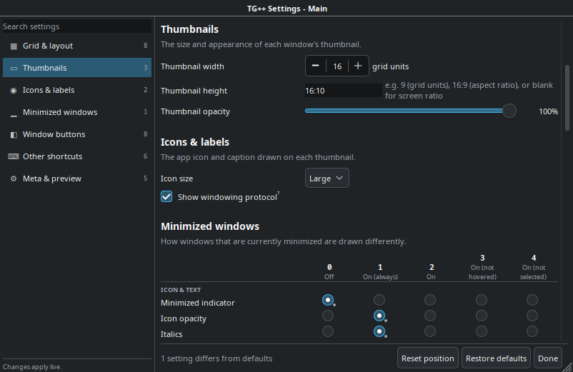
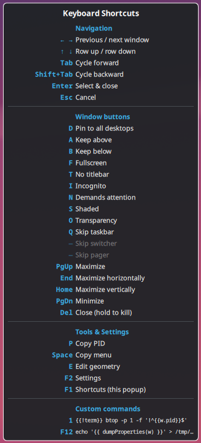

# Thumbnail Grid ++

## Extra features

Compared to the stock Thumbnail Grid switcher:

1. **Highly customizable** - click the Settings button or press `F2` while the task switcher is open.
	- Settings window stays open when task switcher is closed.
	- Also configurable from the Task Switcher preview, but restarting kwin is required to apply the changes.

2. **Hover selection** - show the window just by moving the mouse over it.
	- Requires system Task Switcher setting to be enabled: Visualization → Show selected window. 

3. **Configurable per-window buttons/indicators** on the thumbnails: close, kill, maximize (full / horizontal / vertical), minimize, fullscreen, hide titlebar, pin to all desktops, keep above/below, hide from screenshots, demand attention, shade, transparency, skip taskbar/switcher/pager, debug info window (runs the last custom command), X11/Wayland protocol badge.
	- **Close/kill** - holding for a configurable grace period escalates to killing the process.
	- Keyboard shortcuts for all actions (which work even if the button is hidden).

4. **Copy menu** (`Space`) - copy the window's UUID, PID, executable path, cmdline, caption, CWD, cgroup scope, parent process, desktop file, platform (X11/Wayland), geometry, output, desktops, activities, state flags, or a ready-made KWin window rule.
	- Mnemonic keyboard shortcuts for all entries.

5. **Window geometry editor (`E`)** - edit x/y/width/height/opacity of the selected window in place.
	- Stays open when task switcher is closed.

6. **[20 custom commands](#custom-commands)** (`0`...`9`, `F3`...`F12`) - configurable shell commands (with placeholders for window properties) that run against the selected window.
	- By default:
		- `1` shows the window's process tree in btop
		- `F12` shows a dump of all window properties

7. **Fixes for ultrawide (e.g. 32:9) screens**
	- **Configurable thumbnail height** - the stock Thumbnail Grid produces extremely short and wide thumbnails due to setting the thumbnail height based on the screen aspect ratio.
	- **Max grid aspect ratio** - prevent the task switcher from getting too wide.

8. **Custom styling for minimized windows** to make them easily distinguishable.

9. **Stable grid width/Y-position** - by default, the grid column count and position is latched while the switcher is open, to prevent windows opening or closing from shifting the grid under the cursor.


## Customization

Settings can be reached three ways:

1. **From the switcher itself** (recommended) — press <kbd>F2</kbd> or click the settings button in the bottom-left corner while Alt+Tab (or whichever shortcut you use) is open. Changes apply immediately.
	- Hint: after opening the settings, let go of the modifier key (e.g. <kbd>Alt</kbd>) to show the settings as a separate window. Then you can use other shortcuts (like copy-paste).
2. **From the preview** in System Settings → Window Management → Task Switcher. Changes made here only take effect after KWin is restarted — log out and back in, or run `kwin_wayland --replace` / `kwin_x11 --replace`.
	- NB: Not all changes are visible due to the way the preview is implemented by kwin.
3. **By editing `~/.config/kwin_thumbnail_grid_pp.ini`** directly. The `[Main]` section holds the main switcher's profile and the `[Alt]` section holds the alternative one. Same caveat: KWin must be restarted for the changes to apply.




## Keyboard shortcuts

Press <kbd>F1</kbd> while the switcher is open to see an in-app cheat sheet of all available shortcuts.

All shortcuts can be customized from the settings panel, by first clicking on the shortcut you wish to change and then pressing a key on the keyboard.




## Custom commands

When a custom command keyboard shortcut is triggered, the command is run in the default shell after replacing all placeholders in the custom command string.

**Placeholder syntax**: `{{ <expression> }}` and `{{! <expression> }}`
- `<expression>` is evaluated as [QML JavaScript](https://doc.qt.io/qt-6/qtqml-javascript-functionlist.html), with the following added context:
  - `w` - the window object
  - `dumpProperties(obj, skipFunctions=true)` - a function to dump a JS object's properties as a string
  - Any names defined in the **Placeholders** setting (see below)
- `{{ <expression> }}` is replaced with the expression result, *shell-quoted* (`"` and `'` are escaped using bash syntax)
- `{{! <expression> }}` is replaced with the expression result, *verbatim*
- NB: neither adds quotes *around the result* - you must add them yourself as needed, for example (in bash/fish): `"{{ }}"` allows shell expansion of variables (such as `$HOME`), while `'{{ }}'` prevents shell expansion.

The **Placeholders** setting is a JSON dictionary - excluding the surrounding `{}` - that defines additional common constants (dict value), which can be referenced inside the expressions (by using the dict key as a JS name).

### Example placeholders
```
"term": "konsole",
"listOfApps": ["vlc", "firefox", "kate"],
"dictOfApps": {"browser": "firefox", "editor": "kate"}
```

### Example commands

_These use the example placeholders defined above._

Using `kdialog` to display/debug the result of an expression:
- `kdialog --msgbox "{{ dumpProperties(w) }}"`

	_Shows all properties of the selected window object - useful for writing commands (`F12` also does this by default)._

- `kdialog --msgbox "{{ listOfApps.length + " apps: " + listOfApps.join(", ") }}"`

	_Shows: `3 apps: vlc, firefox, kate`_

- `kdialog --msgbox "{{ Object.keys(dictOfApps).length + ' apps:\\n' + Object.keys(dictOfApps).map(k => '- ' + k + ': ' + dictOfApps[k]).join('\\n') }}"` _- shows:_

	```
	2 apps:
	- browser: firefox
	- editor: kate
	```

Using `kdialog` to prompt for input:
- `CMD=$(kdialog --inputbox "Enter a shell command:" "echo {{ w.resourceClass }}"); kdialog --msgbox "$($CMD)"`

	_Prompts for a shell command to run and shows the output in a second dialog._

- `kdialog --yesno "Freeze {{ w.caption }} (PID {{ w.pid }})?" --yes-label Freeze --no-label Thaw; r=$?; [ $r = 0 ] && kill -STOP {{! w.pid }}; [ $r = 1 ] && kill -CONT {{! w.pid }}`

	_Freezes/thaws the selected window's process, based on which button is clicked._

- `kdialog --yesno "SIGKILL tree of {{ w.resourceClass }} ({{ w.pid }})?" && kill -9 -{{! w.pid }}`

	_Prompts whether to kill the process tree of a window._


## Limitations

### TODO
- Window buttons cannot be reordered.
	- Ideally should have a simple UI editor, instead of a fixed configuration matrix.
- Cleanup the codebase and upstream fixes into kwin to reduce the amount of disgusting hacks/workarounds:
	- Moving kwin internal popup window leaves a trail (damage not properly detected?)
	- kwin internal synthetic keyboard events:
		- empty text field
		- release events are not passed through
	- Keyboard events are missing text
	- General approach for task switchers to expose custom settings
	- General approach for task switchers to show (popup) windows that persist after the task switcher is closed?
- The task switcher stays open after a custom command is ran: windows open in the background.
	- Automatic closing should be configurable, per command.

### Unsure if possible to fix
- The Settings and Edit windows are kwin internal windows, which means they are always on top and do not show up in the taskbar or task switcher.
	- This does not apply to the Debug window, which uses `kdialog` as a workaround.
	- Any fix probably requires adding an external program/service, that can act as the owner of the windows (complicated).
- Task switcher preview: typing space in the settings is not possible, because it just closes the preview.
- Stop relying on the deprecated Plasma5Support.DataSource for running shell commands
	- Also needs a custom external DBus service???

### Not planned, because I personally don't care
- English is the only supported language ([ki18n](https://develop.kde.org/docs/plasma/widget/translations-i18n/)).


## Credits

Initially based on [Thumbnail Grid Fix ("Fast Thumbnails")](https://github.com/era-walk/kde-thumbnail-grid-fix), which is itself a reimplementation of KDE's stock [**Thumbnail Grid** task switcher](https://invent.kde.org/plasma/kwin/-/blob/master/src/tabbox/switchers/thumbnail_grid/contents/ui/main.qml).
